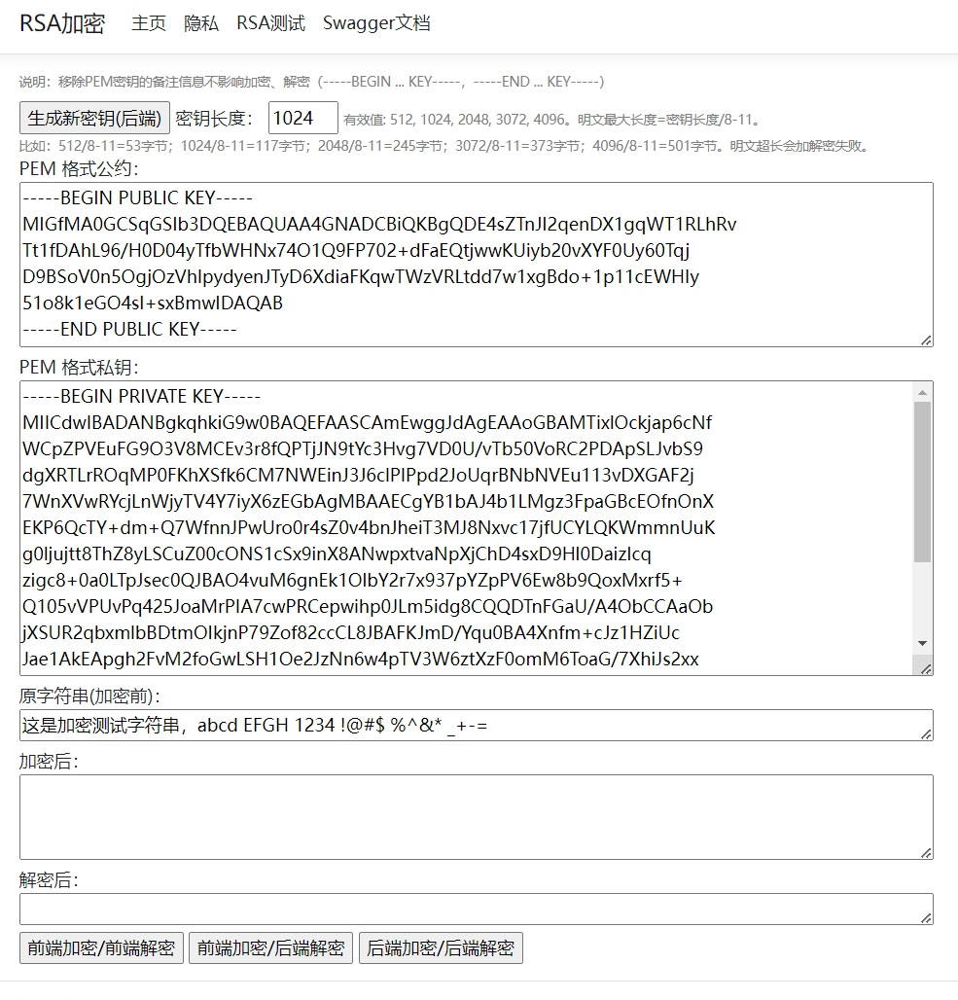

# C# RSA 加密和 Javascript 交互 
## 开发环境
1. Visual Studio 2022
2. 目标框架 .NET 9.0

## 功能
1. C# RSA XML 格式和 PEM 格式密钥互转。[RSAInteractJS/RSA/RSAKeyConverter.cs](RSAInteractJS/RSA/RSAKeyConverter.cs)
2. Javascript RSA 公钥加密和解密；
3. Javascript RSA 公钥加密，C# 私钥解密；
4. C# RSA 公钥加密，私钥解密。

 
